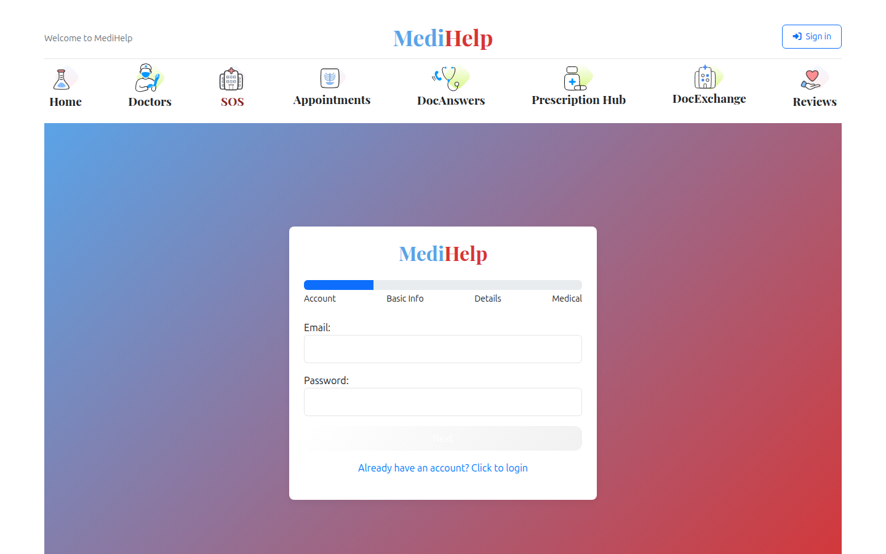
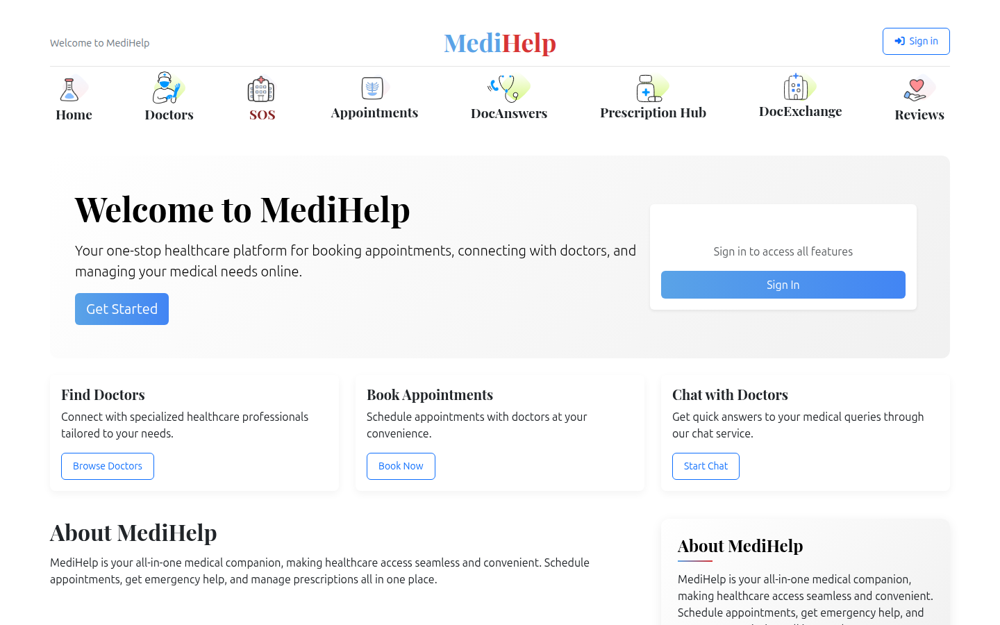
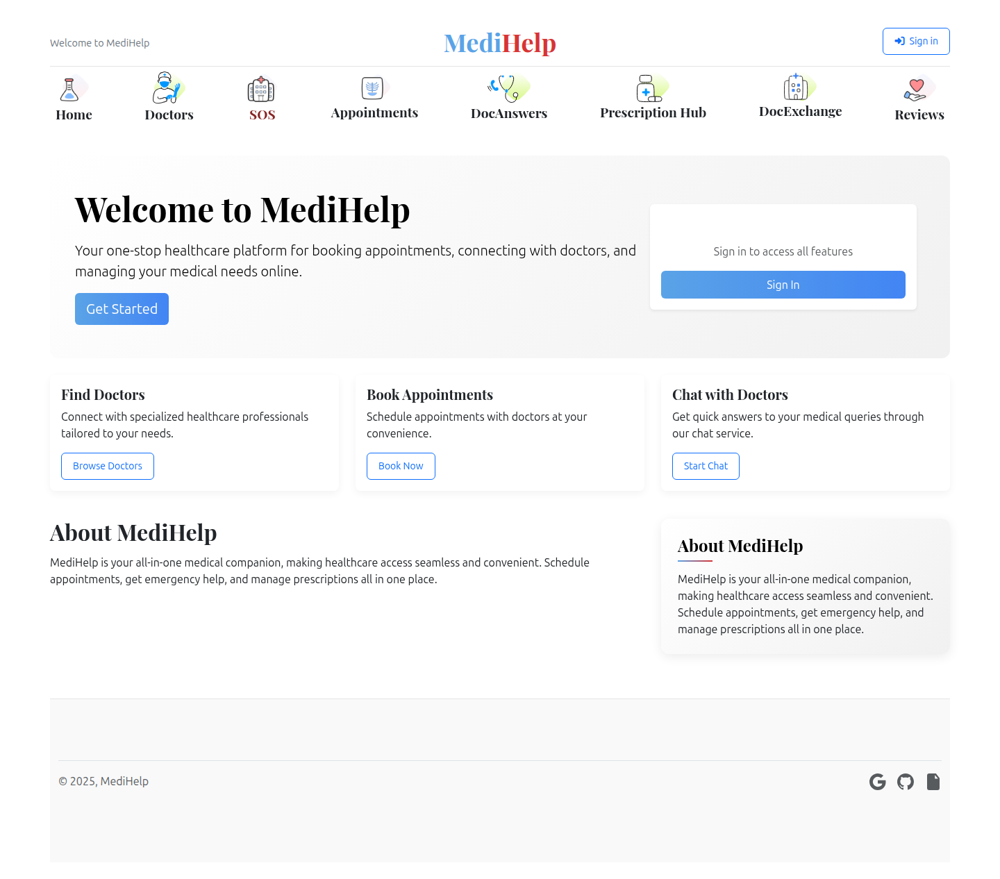

<p align="center">
  
</p>

<h1 align="center">MediHelp</h1>

<p align="center">
  <b>A modern, full-stack healthcare platform connecting patients, doctors, and emergency services.</b>
</p>

<p align="center">
  
  
  
  
  
</p>

---

## Preview

<p align="center">
  
  <br />
  <em>Landing Page — Clean, modern hero with quick navigation</em>
</p>

<details>
<summary><b>More Screenshots</b> (click to expand)</summary>
<br />

| Sign Up | Login |
|:---:|:---:|
|  |  |

| About | Help Center |
|:---:|:---:|
|  |  |

<p align="center">
  
  <br />
  <em>Full Landing Page</em>
</p>

</details>

---

## Highlights

| Feature | Description |
|---|---|
| **Appointment Scheduling** | Interactive weekly calendar with 30-min slots, color-coded availability, animated booking confirmation |
| **Doctor Dashboard** | Manage schedule, view patients, handle appointment requests, configure working hours |
| **Profile Management** | Edit personal/professional details, upload profile photo, role-specific fields |
| **Emergency SOS** | One-tap emergency with geolocation, nearby hospital routing, email/SMS notifications |
| **Real-time Chat** | Socket.io powered messaging between patients and doctors with unread tracking |
| **Prescription Hub** | Digital prescriptions — doctors create, patients view and download |
| **Community Forums** | Medical Q&A forums with doctor-verified answers |
| **Reviews & Ratings** | Patients rate and review doctors; aggregated ratings on profiles |
| **Hospital Directory** | Browse hospitals by location with services, contact info, and maps |
| **Security** | Role-based access, data isolation between users, JWT auth, password hashing |

---

## Tech Stack

| Layer | Technologies |
|---|---|
| **Frontend** | React 18, React Router v6, Framer Motion, Axios, Bootstrap 5 |
| **Backend** | Node.js, Express 4.x, Socket.io |
| **Database** | MongoDB with Mongoose ODM |
| **Auth** | JWT (JSON Web Tokens), bcrypt password hashing |
| **File Uploads** | Multer (profile photos) |
| **Notifications** | Nodemailer (email), Twilio (SMS) |
| **Dev Tools** | Nodemon, Concurrently, ESLint, Puppeteer (screenshots) |

---

## Architecture

```
medihelppvt/
├── src/                    # React frontend
│   ├── components/         # Reusable UI components
│   ├── pages/              # Route-level page components
│   ├── contexts/           # React Context providers (Auth, Backend)
│   ├── hooks/              # Custom hooks (useBackendState)
│   ├── services/           # API service layer (Axios)
│   └── styles/             # CSS modules
│
├── backend/                # Express API server
│   ├── controllers/        # Request handlers
│   ├── models/             # Mongoose schemas
│   ├── routes/             # API route definitions
│   ├── middleware/         # Auth & error middleware
│   ├── services/           # Business logic
│   ├── socket/             # Socket.io handlers
│   └── uploads/            # User-uploaded files
│
├── public/                 # Static assets
└── docs/                   # Documentation & screenshots
```

---

## Getting Started

### Prerequisites

- **Node.js** v16+ and npm
- **MongoDB** (local or Atlas cloud)
- **Google Chrome** (for screenshot scripts, optional)

> **New to all this?** Follow the [Complete Beginner Setup Guide](docs/SETUP_GUIDE.md) — it walks through installing Node.js, MongoDB, Git, Twilio, Gmail App Passwords, and everything else from scratch, for both **Windows** and **Linux**.

### Quick Setup (one command)

After cloning, run the interactive setup script — it handles everything:

```bash
git clone https://github.com/BhargavShekokar3425/medihelppvt.git
cd medihelppvt
npm run install-all
node scripts/setup.js
```

The script will auto-detect your system, generate secrets, ask for your MongoDB URI, and optionally configure email/SMS — no manual file editing needed.

### Manual Setup

### 1. Clone the repository

```bash
git clone https://github.com/BhargavShekokar3425/medihelppvt.git
cd medihelppvt
```

### 2. Install dependencies

```bash
npm run install-all
```

This installs both frontend and backend packages in one command.

### 3. Configure environment

Copy the example config and fill in **your own** values:

```bash
cp backend/config/config.env.example backend/config/config.env
```

Then generate a **unique JWT secret** (every developer must have their own):

```bash
node -e "console.log(require('crypto').randomBytes(64).toString('hex'))"
```

Paste the output into `backend/config/config.env` as your `JWT_SECRET`.

> **What goes where?**
>
> | Variable | Who sets it | Notes |
> |---|---|---|
> | `PORT` | Each user | Default `5000`, change if port is busy |
> | `MONGO_URI` | Each user | Your own local or Atlas MongoDB URI |
> | `JWT_SECRET` | **Each user (unique!)** | Generate with the command above — never share |
> | `JWT_EXPIRE` | Each user | Token lifetime, e.g. `30d` |
> | `EMAIL_USER` / `EMAIL_PASS` | Each user (optional) | Your Gmail + [App Password](https://myaccount.google.com/apppasswords) |
> | `TWILIO_*` | Each user (optional) | Your own [Twilio](https://www.twilio.com/) credentials |
>
> `config.env` is gitignored — it never gets committed. Only `config.env.example` (the template) is in the repo.

### 4. Seed sample data (optional)

```bash
cd backend && node seed.js
```

### 5. Start development servers

```bash
npm run dev
```

| Service | URL |
|---|---|
| Frontend | [http://localhost:5001](http://localhost:5001) |
| Backend API | [http://localhost:5000/api](http://localhost:5000/api) |

---

## API Reference

### Authentication
| Method | Endpoint | Description |
|---|---|---|
| `POST` | `/api/auth/register` | Register a new user |
| `POST` | `/api/auth/login` | Login and receive JWT |

### Users & Profiles
| Method | Endpoint | Description |
|---|---|---|
| `GET` | `/api/users/profile` | Get current user profile |
| `PUT` | `/api/users/profile` | Update profile (role-based fields) |
| `POST` | `/api/users/profile/photo` | Upload profile photo |
| `GET` | `/api/users/doctors` | List doctors (public info only) |
| `GET` | `/api/users/patients` | Doctor's own patients only |

### Appointments
| Method | Endpoint | Description |
|---|---|---|
| `POST` | `/api/appointments` | Book an appointment |
| `GET` | `/api/appointments` | List appointments (role-filtered) |
| `GET` | `/api/appointments/upcoming` | Upcoming appointments |
| `PUT` | `/api/appointments/:id` | Update appointment status |
| `GET` | `/api/appointments/doctor-availability/:id` | Check doctor slots |
| `GET` | `/api/appointments/check-availability` | Slot availability check |

### Emergency
| Method | Endpoint | Description |
|---|---|---|
| `POST` | `/api/emergency/sos` | Trigger SOS with geolocation |
| `GET` | `/api/emergency/hospitals` | List nearby hospitals |

### Chat & Messaging
| Method | Endpoint | Description |
|---|---|---|
| `GET` | `/api/chat/conversations` | List conversations |
| `POST` | `/api/chat/send` | Send a message |
| `GET` | `/api/chat/messages/:conversationId` | Get messages |

### Other
| Method | Endpoint | Description |
|---|---|---|
| `POST` | `/api/reviews` | Submit a review |
| `GET` | `/api/reviews/:doctorId` | Get doctor reviews |
| `GET` | `/api/health` | System health check |

---

## Security Model

MediHelp implements strict role-based data isolation:

- **Patients** can only see their own appointments and available slots — no access to other patients' data or doctor schedules
- **Doctors** can only see their own schedule and their own patients (via appointment history) — cannot view other doctors' data
- **Profile updates** enforce role-specific field whitelists — patients cannot set doctor fields and vice versa
- **Appointment queries** return role-appropriate populated fields — patients see doctor public info, doctors see patient medical info
- **Passwords** are hashed with bcrypt (12 rounds) and never returned in API responses

---

## Available Scripts

| Command | Description |
|---|---|
| `npm run dev` | Run frontend + backend concurrently (development) |
| `npm start` | Start React frontend only |
| `npm run server` | Start backend server only |
| `npm run server:dev` | Start backend with hot-reload (nodemon) |
| `npm run build` | Create production build |
| `npm run install-all` | Install all dependencies |
| `npm test` | Run test suite |

---

## Contributing

1. Fork the repository
2. Create your feature branch (`git checkout -b feature/amazing-feature`)
3. Commit your changes (`git commit -m 'Add amazing feature'`)
4. Push to the branch (`git push origin feature/amazing-feature`)
5. Open a Pull Request

---

## License

This project is licensed under the MIT License.

---

<!-- ## Team

| Name | Role |
|---|---|
| **Bhargav Shekokar** | Lead Developer |
| **Saher Dev** | Developer |
| **Namya Dhingra** | Developer |
| **Devesh Labana** | Developer |
| **Ishan Bhambhare** | Developer |
| **Nitish Gupta** | Developer | -->

<p align="center">
  <br />
  <b>Built with care for better healthcare access.</b>
  <br /><br />
  For queries, open an issue or contact: <a href="mailto:bnshekokar@gmail.com">bnshekokar@gmail.com</a>
</p>

