<p align="center">
  
</p>

<h1 align="center">MediHelp</h1>

<p align="center">
  <b>A modern, full-stack healthcare platform connecting patients, doctors, and emergency services.</b>
</p>

<p align="center">
  
  
  
  
  
</p>

---

## Preview

<p align="center">
  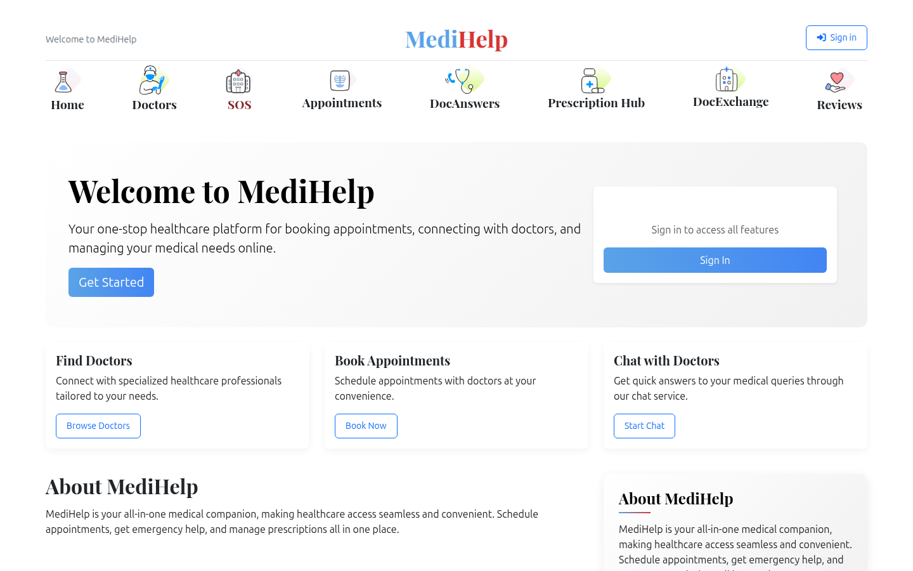
  <br />
  <em>Landing Page — Clean, modern hero with quick navigation</em>
</p>

<details>
<summary><b>More Screenshots</b> (click to expand)</summary>
<br />

| Sign Up | Appointments |
|:---:|:---:|
| 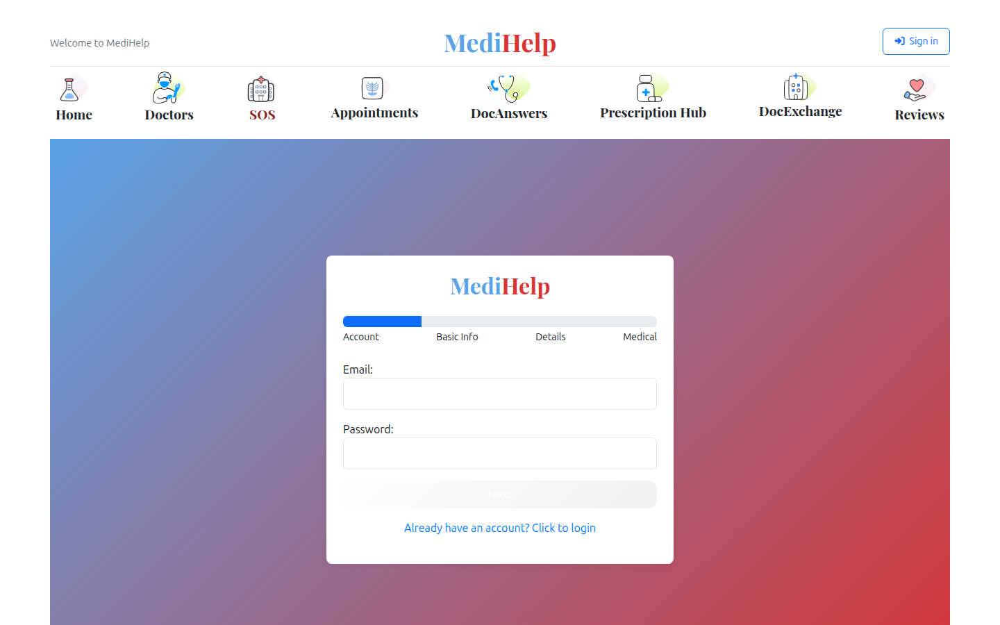 | 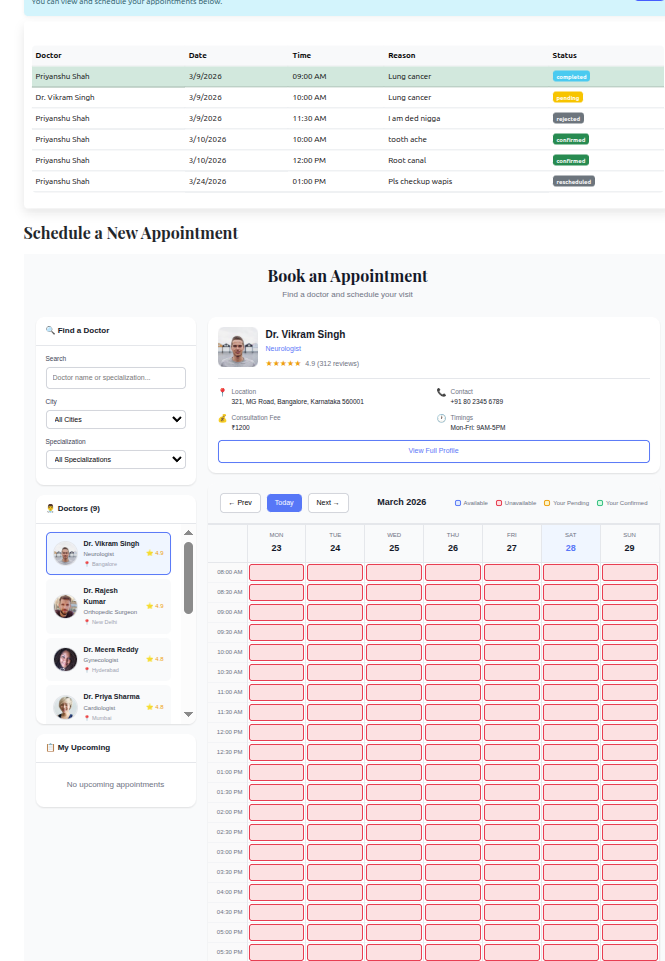 |

| Community forum | doc-answers |
|:---:|:---:|
| 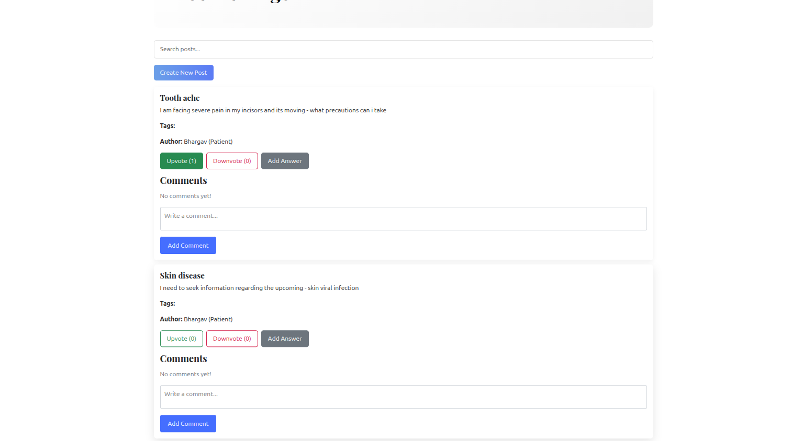 | 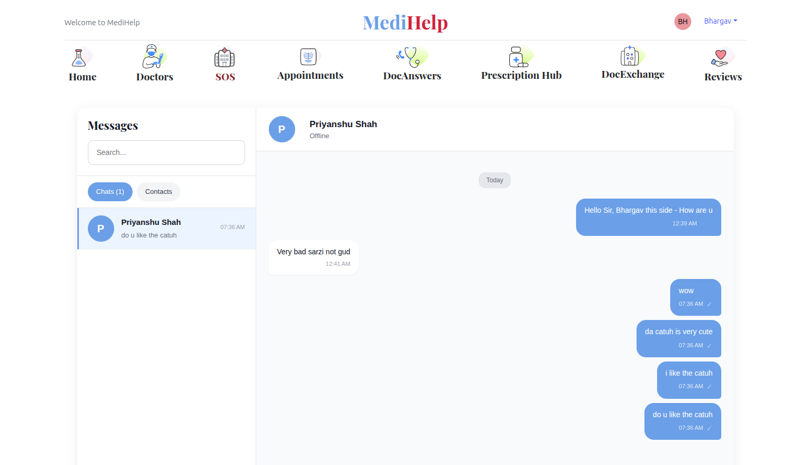 |

| doc-requests | doctors-page |
|:---:|:---:|
| 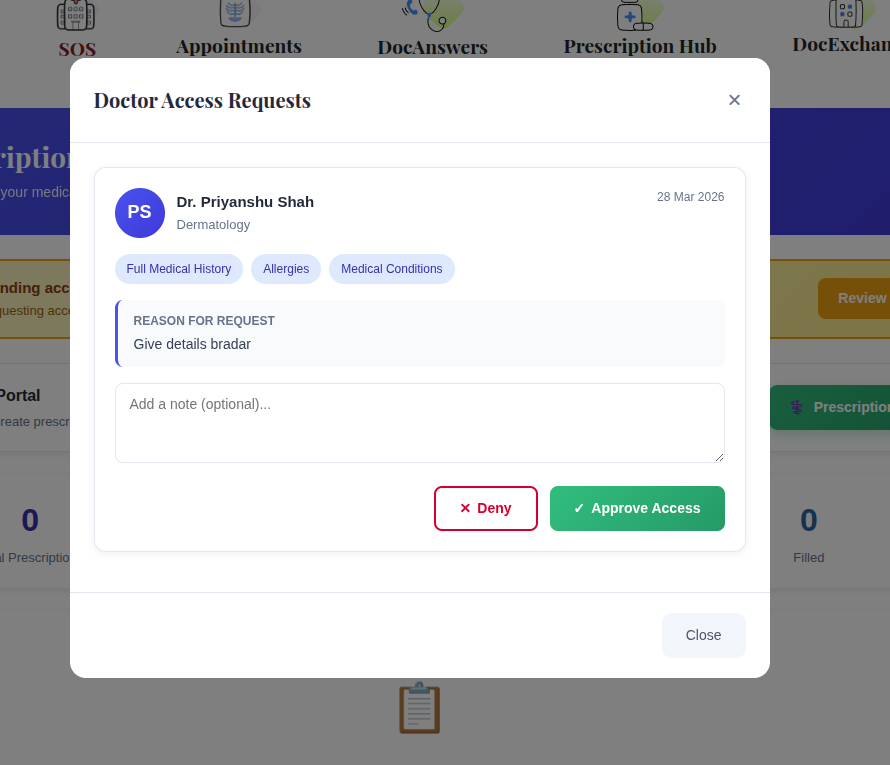 |  |

| medicine-request | prescription-hub |
|:---:|:---:|
| 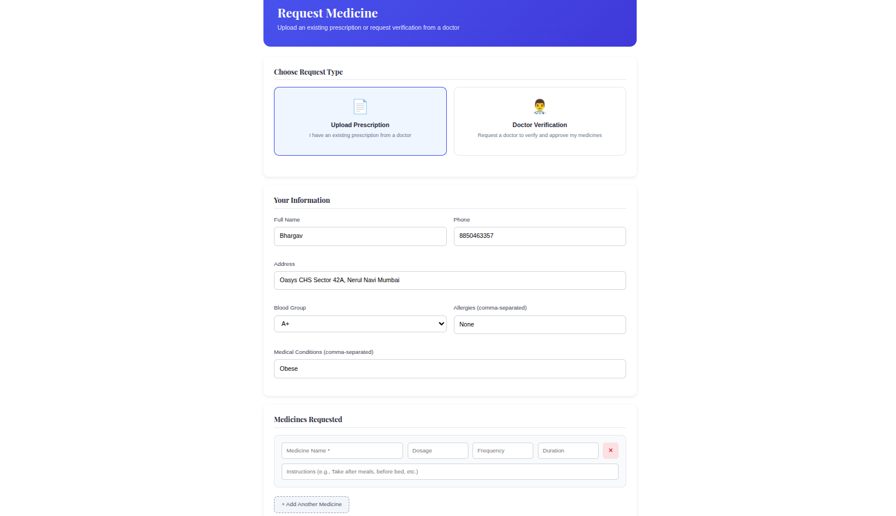 | 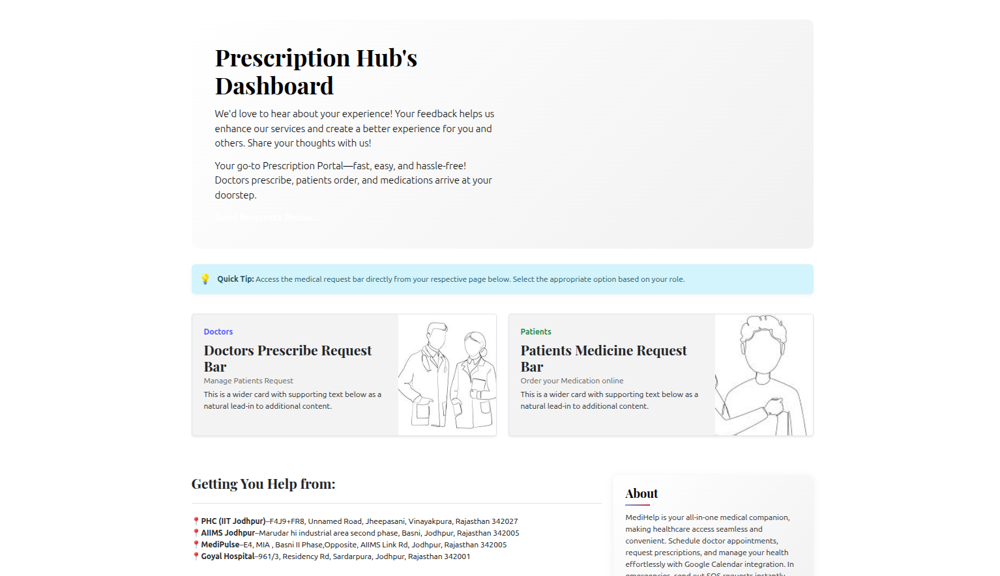 |

</details>

---

## Highlights

| Feature | Description |
|---|---|
| **Appointment Scheduling** | Interactive weekly calendar with 30-min slots, color-coded availability, animated booking confirmation |
| **Doctor Dashboard** | Manage schedule, view patients, handle appointment requests, configure working hours |
| **Profile Management** | Edit personal/professional details, upload profile photo, role-specific fields |
| **Emergency SOS** | One-tap emergency with geolocation, nearby hospital routing, email/SMS notifications |
| **Real-time Chat** | Socket.io messaging with WhatsApp-style read receipts (sent/delivered/read), typing indicators, online status, message pagination |
| **Prescription Hub** | Digital prescriptions — doctors create, patients view and download |
| **Medicine Request Portal** | Patients can upload prescriptions or request doctor verification for medicines |
| **Access Request System** | Doctors can request access to patient medical records; patients review and approve/deny via notification dialogs |
| **Role-Based Access Control** | Smart dialogs redirect users to correct pages based on their role (doctor/patient) |
| **Patient Directory** | Doctors can browse and search patient directory, send access requests |
| **Community Forums** | Medical Q&A forums with doctor-verified answers |
| **Reviews & Ratings** | Patients rate and review doctors; aggregated ratings on profiles |
| **Hospital Directory** | Browse hospitals by location with services, contact info, and maps |
| **Security** | Role-based access, data isolation between users, JWT auth, password hashing |

---

## Tech Stack

| Layer | Technologies |
|---|---|
| **Frontend** | React 18, React Router v6, Framer Motion, Axios, Bootstrap 5 |
| **Backend** | Node.js, Express 4.x, Socket.io |
| **Database** | MongoDB with Mongoose ODM |
| **Auth** | JWT (JSON Web Tokens), bcrypt password hashing |
| **File Uploads** | Multer (profile photos) |
| **Notifications** | Nodemailer (email), Twilio (SMS) |
| **Dev Tools** | Nodemon, Concurrently, ESLint, Puppeteer (screenshots) |

---

## Architecture

```
medihelppvt/
├── src/                    # React frontend
│   ├── components/         # Reusable UI components
│   │   └── RequestBar.js   # Role-based request navigation
│   ├── pages/              # Route-level page components
│   │   ├── PresPatients.js # Patient prescriptions with access request notifications
│   │   ├── PresDoctors.js  # Doctor prescription creation with patient directory
│   │   ├── MedicineRequestPortal.js  # Medicine request form
│   │   ├── PatientDirectory.js       # Doctor's patient browser
│   │   └── PatientPrescription.js    # Patient prescription requests
│   ├── contexts/           # React Context providers (Auth, Backend)
│   ├── hooks/              # Custom hooks (useBackendState)
│   ├── services/           # API service layer (Axios)
│   └── styles/             # CSS modules
│
├── backend/                # Express API server
│   ├── controllers/        # Request handlers
│   ├── models/             # Mongoose schemas
│   │   ├── AccessRequest.model.js    # Doctor-patient access requests
│   │   ├── MedicineRequest.model.js  # Patient medicine requests
│   │   └── Prescription.model.js     # Digital prescriptions
│   ├── routes/             # API route definitions
│   │   ├── accessRequest.routes.js   # Access request endpoints
│   │   └── medicineRequest.routes.js # Medicine request endpoints
│   ├── middleware/         # Auth & error middleware
│   ├── services/           # Business logic
│   │   └── pdfService.js   # PDF generation for prescriptions
│   ├── socket/             # Socket.io handlers
│   └── uploads/            # User-uploaded files
│       └── prescriptions/  # Uploaded prescription images/PDFs
│
├── public/                 # Static assets
└── docs/                   # Documentation & screenshots
```

---

## System Diagrams (UML)

> **Note:** These diagrams are rendered dynamically by GitHub using Mermaid. If they don't render, view the raw markdown or use a Mermaid-compatible viewer.

### System Architecture (Component Diagram)

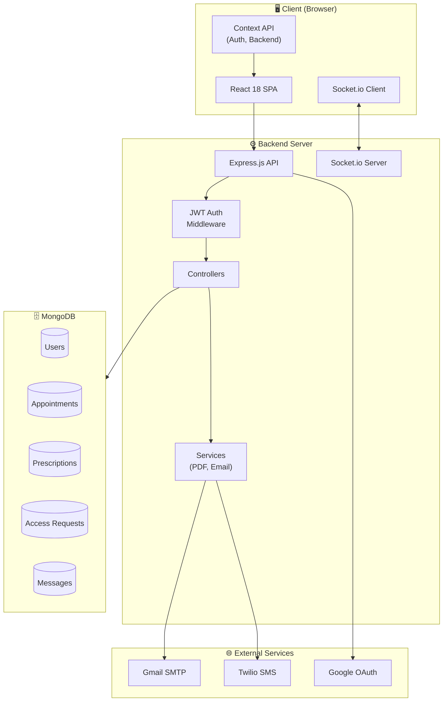
```mermaid
flowchart TB
    subgraph Client["🖥️ Client (Browser)"]
        React["React 18 SPA"]
        SocketClient["Socket.io Client"]
        Context["Context API\n(Auth, Backend)"]
    end

    subgraph Server["⚙️ Backend Server"]
        Express["Express.js API"]
        SocketServer["Socket.io Server"]
        Auth["JWT Auth\nMiddleware"]
        Controllers["Controllers"]
        Services["Services\n(PDF, Email)"]
    end

    subgraph Database["🗄️ MongoDB"]
        Users[(Users)]
        Appointments[(Appointments)]
        Prescriptions[(Prescriptions)]
        AccessRequests[(Access Requests)]
        Messages[(Messages)]
    end

    subgraph External["🌐 External Services"]
        Gmail["Gmail SMTP"]
        Twilio["Twilio SMS"]
        GoogleOAuth["Google OAuth"]
    end

    React --> Express
    SocketClient <--> SocketServer
    Context --> React
    Express --> Auth
    Auth --> Controllers
    Controllers --> Services
    Controllers --> Database
    Services --> Gmail
    Services --> Twilio
    Express --> GoogleOAuth
```

### User Authentication Flow

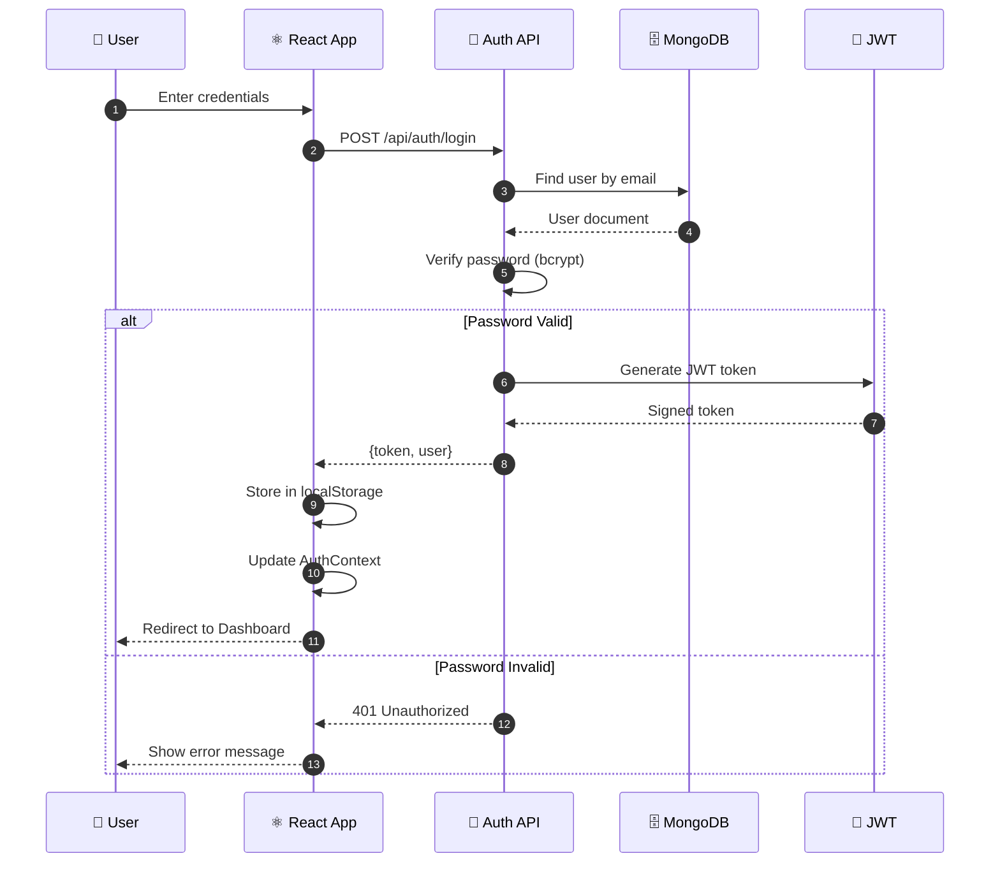
```mermaid
sequenceDiagram
    autonumber
    participant U as 👤 User
    participant R as ⚛️ React App
    participant A as 🔐 Auth API
    participant DB as 🗄️ MongoDB
    participant J as 🎫 JWT

    U->>R: Enter credentials
    R->>A: POST /api/auth/login
    A->>DB: Find user by email
    DB-->>A: User document
    A->>A: Verify password (bcrypt)
    alt Password Valid
        A->>J: Generate JWT token
        J-->>A: Signed token
        A-->>R: {token, user}
        R->>R: Store in localStorage
        R->>R: Update AuthContext
        R-->>U: Redirect to Dashboard
    else Password Invalid
        A-->>R: 401 Unauthorized
        R-->>U: Show error message
    end
```

### Prescription Creation Flow (Doctor)

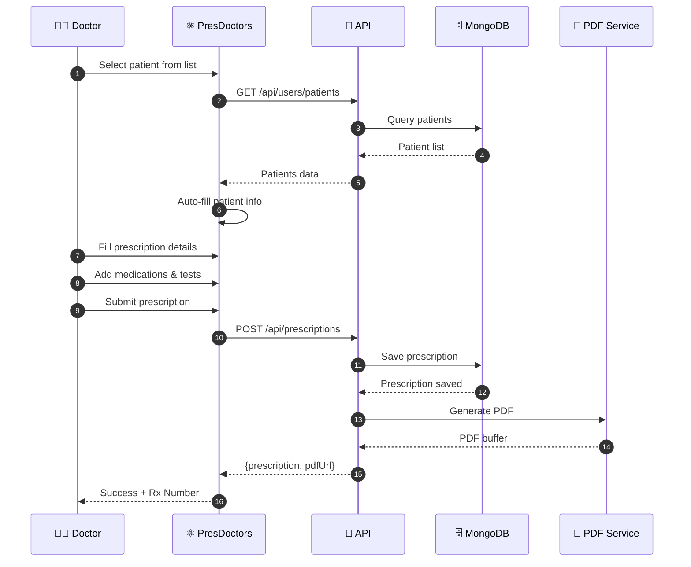
```mermaid
sequenceDiagram
    autonumber
    participant D as 👨‍⚕️ Doctor
    participant R as ⚛️ PresDoctors
    participant API as 🔌 API
    participant DB as 🗄️ MongoDB
    participant PDF as 📄 PDF Service

    D->>R: Select patient from list
    R->>API: GET /api/users/patients
    API->>DB: Query patients
    DB-->>API: Patient list
    API-->>R: Patients data
    R->>R: Auto-fill patient info

    D->>R: Fill prescription details
    D->>R: Add medications & tests
    D->>R: Submit prescription

    R->>API: POST /api/prescriptions
    API->>DB: Save prescription
    DB-->>API: Prescription saved
    API->>PDF: Generate PDF
    PDF-->>API: PDF buffer
    API-->>R: {prescription, pdfUrl}
    R-->>D: Success + Rx Number
```

### Access Request Flow (Doctor ↔ Patient)

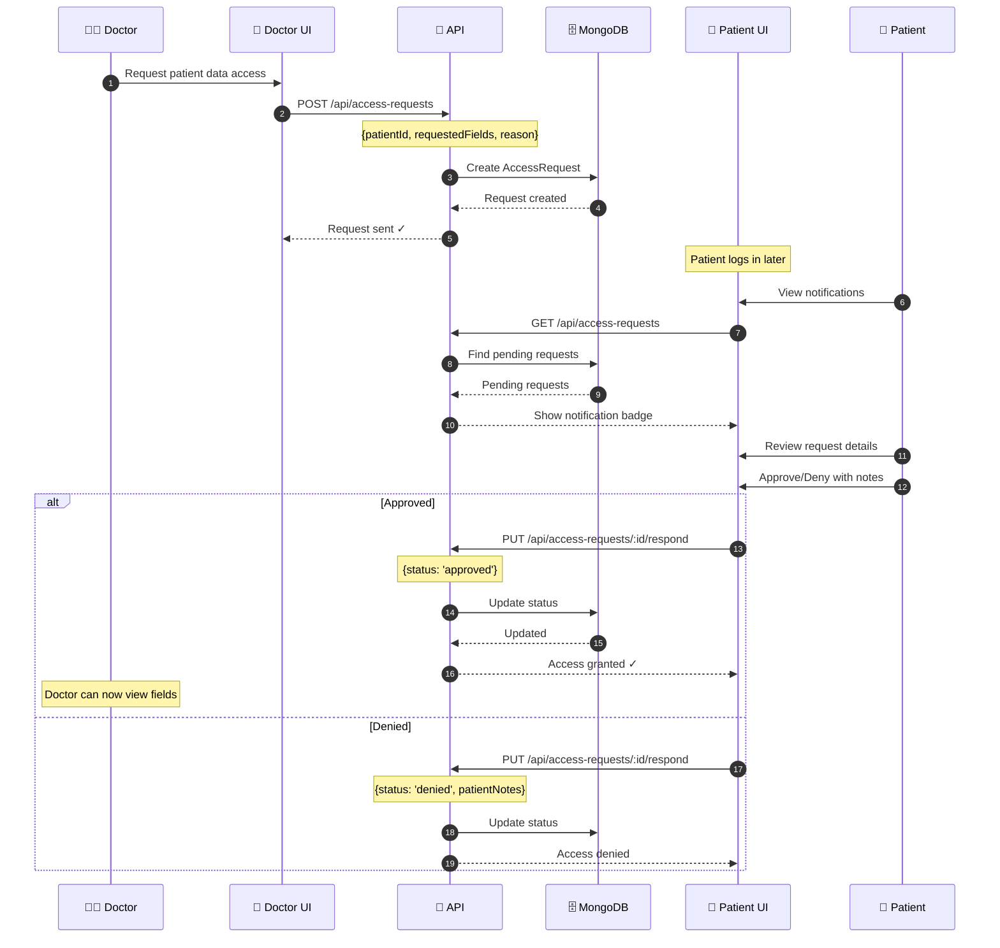
```mermaid
sequenceDiagram
    autonumber
    participant Dr as 👨‍⚕️ Doctor
    participant DrUI as 📱 Doctor UI
    participant API as 🔌 API
    participant DB as 🗄️ MongoDB
    participant PtUI as 📱 Patient UI
    participant Pt as 👤 Patient

    Dr->>DrUI: Request patient data access
    DrUI->>API: POST /api/access-requests
    Note over API: {patientId, requestedFields, reason}
    API->>DB: Create AccessRequest
    DB-->>API: Request created
    API-->>DrUI: Request sent ✓

    Note over PtUI: Patient logs in later
    Pt->>PtUI: View notifications
    PtUI->>API: GET /api/access-requests
    API->>DB: Find pending requests
    DB-->>API: Pending requests
    API-->>PtUI: Show notification badge

    Pt->>PtUI: Review request details
    Pt->>PtUI: Approve/Deny with notes

    alt Approved
        PtUI->>API: PUT /api/access-requests/:id/respond
        Note over API: {status: 'approved'}
        API->>DB: Update status
        DB-->>API: Updated
        API-->>PtUI: Access granted ✓
        Note over Dr: Doctor can now view fields
    else Denied
        PtUI->>API: PUT /api/access-requests/:id/respond
        Note over API: {status: 'denied', patientNotes}
        API->>DB: Update status
        API-->>PtUI: Access denied
    end
```

### Medicine Request Flow

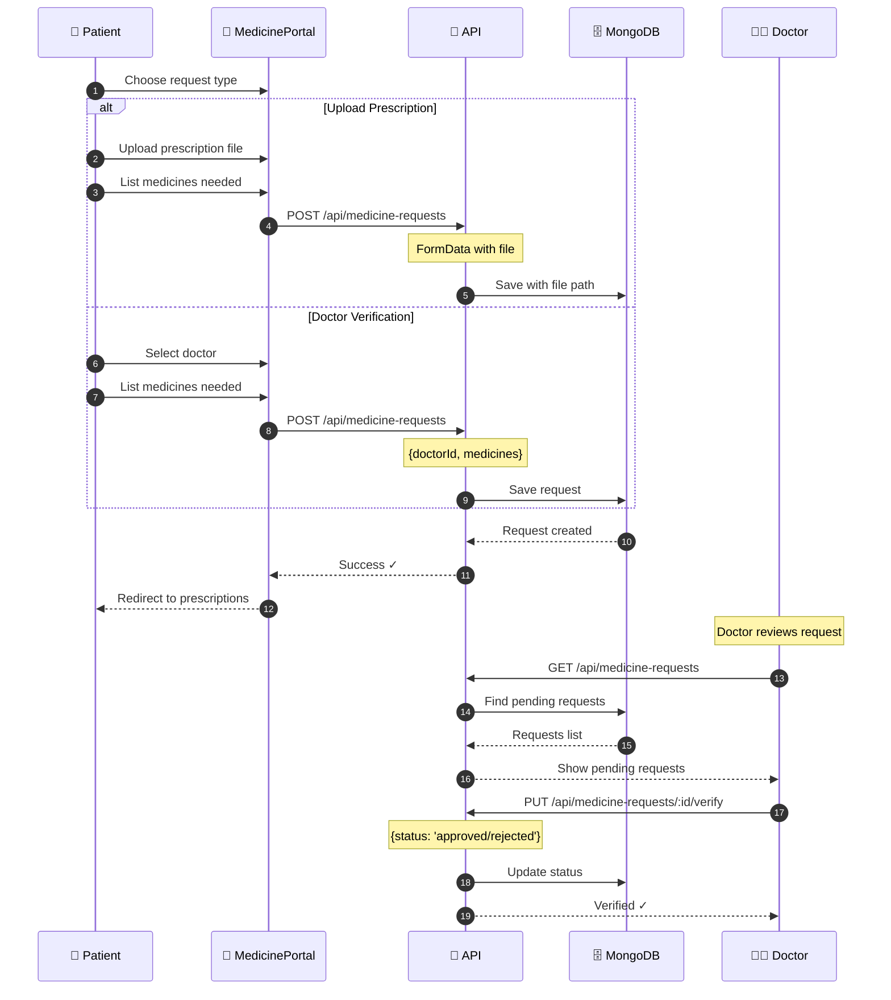
```mermaid
sequenceDiagram
    autonumber
    participant P as 👤 Patient
    participant UI as 📱 MedicinePortal
    participant API as 🔌 API
    participant DB as 🗄️ MongoDB
    participant Dr as 👨‍⚕️ Doctor

    P->>UI: Choose request type
    alt Upload Prescription
        P->>UI: Upload prescription file
        P->>UI: List medicines needed
        UI->>API: POST /api/medicine-requests
        Note over API: FormData with file
        API->>DB: Save with file path
    else Doctor Verification
        P->>UI: Select doctor
        P->>UI: List medicines needed
        UI->>API: POST /api/medicine-requests
        Note over API: {doctorId, medicines}
        API->>DB: Save request
    end

    DB-->>API: Request created
    API-->>UI: Success ✓
    UI-->>P: Redirect to prescriptions

    Note over Dr: Doctor reviews request
    Dr->>API: GET /api/medicine-requests
    API->>DB: Find pending requests
    DB-->>API: Requests list
    API-->>Dr: Show pending requests

    Dr->>API: PUT /api/medicine-requests/:id/verify
    Note over API: {status: 'approved/rejected'}
    API->>DB: Update status
    API-->>Dr: Verified ✓
```

### Real-time Chat Flow

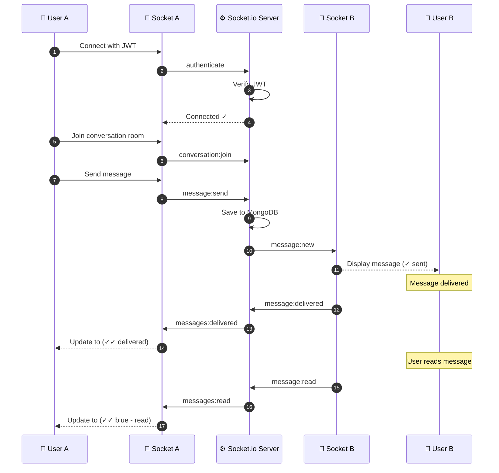
```mermaid
sequenceDiagram
    autonumber
    participant U1 as 👤 User A
    participant S1 as 🔌 Socket A
    participant Server as ⚙️ Socket.io Server
    participant S2 as 🔌 Socket B
    participant U2 as 👤 User B

    U1->>S1: Connect with JWT
    S1->>Server: authenticate
    Server->>Server: Verify JWT
    Server-->>S1: Connected ✓

    U1->>S1: Join conversation room
    S1->>Server: conversation:join

    U1->>S1: Send message
    S1->>Server: message:send
    Server->>Server: Save to MongoDB
    Server->>S2: message:new
    S2-->>U2: Display message (✓ sent)

    Note over U2: Message delivered
    S2->>Server: message:delivered
    Server->>S1: messages:delivered
    S1-->>U1: Update to (✓✓ delivered)

    Note over U2: User reads message
    S2->>Server: message:read
    Server->>S1: messages:read
    S1-->>U1: Update to (✓✓ blue - read)
```

### Entity Relationship Diagram

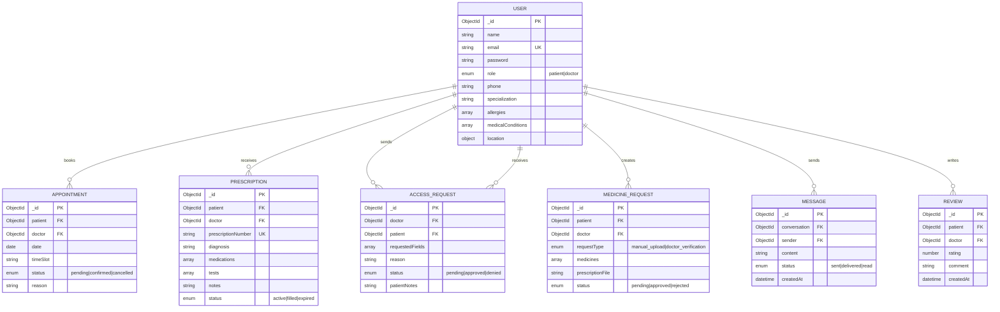
```mermaid
erDiagram
    USER ||--o{ APPOINTMENT : books
    USER ||--o{ PRESCRIPTION : receives
    USER ||--o{ ACCESS_REQUEST : sends
    USER ||--o{ ACCESS_REQUEST : receives
    USER ||--o{ MEDICINE_REQUEST : creates
    USER ||--o{ MESSAGE : sends
    USER ||--o{ REVIEW : writes

    USER {
        ObjectId _id PK
        string name
        string email UK
        string password
        enum role "patient|doctor"
        string phone
        string specialization
        array allergies
        array medicalConditions
        object location
    }

    APPOINTMENT {
        ObjectId _id PK
        ObjectId patient FK
        ObjectId doctor FK
        date date
        string timeSlot
        enum status "pending|confirmed|cancelled"
        string reason
    }

    PRESCRIPTION {
        ObjectId _id PK
        ObjectId patient FK
        ObjectId doctor FK
        string prescriptionNumber UK
        string diagnosis
        array medications
        array tests
        string notes
        enum status "active|filled|expired"
    }

    ACCESS_REQUEST {
        ObjectId _id PK
        ObjectId doctor FK
        ObjectId patient FK
        array requestedFields
        string reason
        enum status "pending|approved|denied"
        string patientNotes
    }

    MEDICINE_REQUEST {
        ObjectId _id PK
        ObjectId patient FK
        ObjectId doctor FK
        enum requestType "manual_upload|doctor_verification"
        array medicines
        string prescriptionFile
        enum status "pending|approved|rejected"
    }

    MESSAGE {
        ObjectId _id PK
        ObjectId conversation FK
        ObjectId sender FK
        string content
        enum status "sent|delivered|read"
        datetime createdAt
    }

    REVIEW {
        ObjectId _id PK
        ObjectId patient FK
        ObjectId doctor FK
        number rating
        string comment
        datetime createdAt
    }
```

### Appointment State Diagram

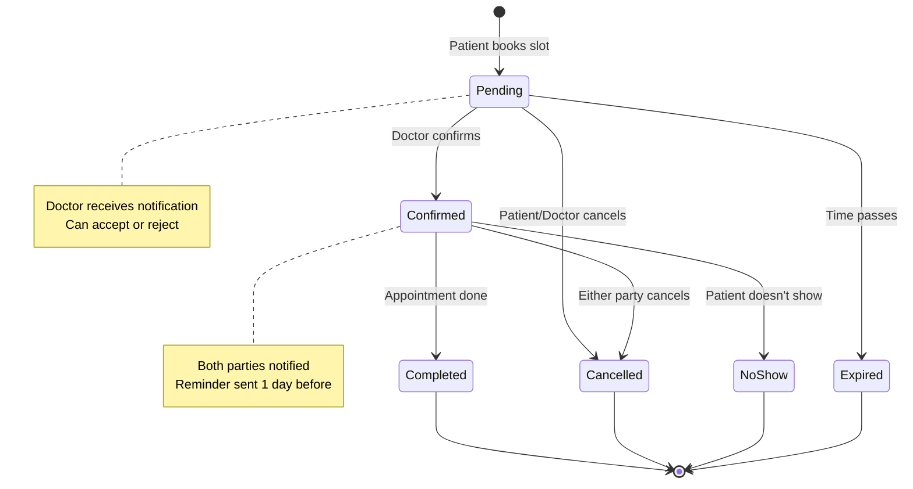
```mermaid
stateDiagram-v2
    [*] --> Pending: Patient books slot

    Pending --> Confirmed: Doctor confirms
    Pending --> Cancelled: Patient/Doctor cancels
    Pending --> Expired: Time passes

    Confirmed --> Completed: Appointment done
    Confirmed --> Cancelled: Either party cancels
    Confirmed --> NoShow: Patient doesn't show

    Completed --> [*]
    Cancelled --> [*]
    NoShow --> [*]
    Expired --> [*]

    note right of Pending
        Doctor receives notification
        Can accept or reject
    end note

    note right of Confirmed
        Both parties notified
        Reminder sent 1 day before
    end note
```

### Access Request State Diagram

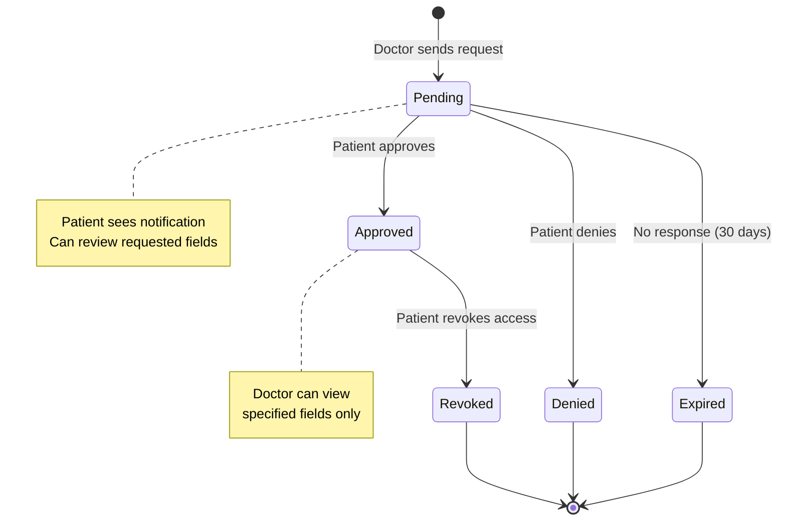
```mermaid
stateDiagram-v2
    [*] --> Pending: Doctor sends request

    Pending --> Approved: Patient approves
    Pending --> Denied: Patient denies
    Pending --> Expired: No response (30 days)

    Approved --> Revoked: Patient revokes access

    Revoked --> [*]
    Denied --> [*]
    Expired --> [*]

    note right of Pending
        Patient sees notification
        Can review requested fields
    end note

    note right of Approved
        Doctor can view
        specified fields only
    end note
```

### Role-Based Page Access

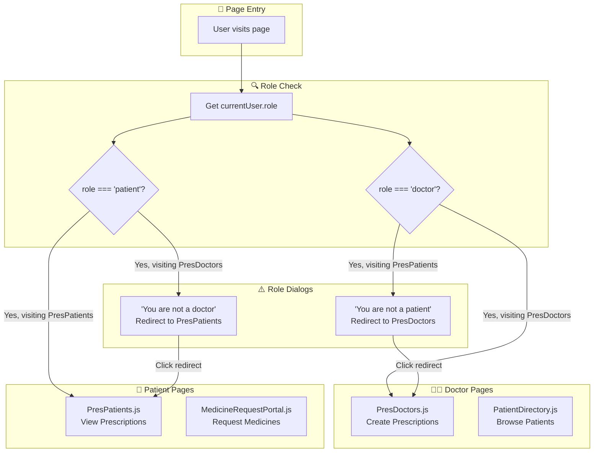
```mermaid
flowchart TD
    subgraph Entry["🚪 Page Entry"]
        User["User visits page"]
    end

    subgraph Check["🔍 Role Check"]
        GetRole["Get currentUser.role"]
        IsDoctor{"role === 'doctor'?"}
        IsPatient{"role === 'patient'?"}
    end

    subgraph DoctorPages["👨‍⚕️ Doctor Pages"]
        PresDoctors["PresDoctors.js\nCreate Prescriptions"]
        PatientDir["PatientDirectory.js\nBrowse Patients"]
    end

    subgraph PatientPages["👤 Patient Pages"]
        PresPatients["PresPatients.js\nView Prescriptions"]
        MedicineReq["MedicineRequestPortal.js\nRequest Medicines"]
    end

    subgraph Dialogs["⚠️ Role Dialogs"]
        DoctorDialog["'You are not a patient'\nRedirect to PresDoctors"]
        PatientDialog["'You are not a doctor'\nRedirect to PresPatients"]
    end

    User --> GetRole
    GetRole --> IsDoctor

    IsDoctor -->|Yes, visiting PresPatients| DoctorDialog
    IsDoctor -->|Yes, visiting PresDoctors| PresDoctors

    GetRole --> IsPatient
    IsPatient -->|Yes, visiting PresDoctors| PatientDialog
    IsPatient -->|Yes, visiting PresPatients| PresPatients

    DoctorDialog -->|Click redirect| PresDoctors
    PatientDialog -->|Click redirect| PresPatients
```

---

## Getting Started

### Prerequisites

- **Node.js** v16+ and npm
- **MongoDB** (local or Atlas cloud)
- **Google Chrome** (for screenshot scripts, optional)

> **New to all this?** Follow the [Complete Beginner Setup Guide](docs/SETUP_GUIDE.md) — it walks through installing Node.js, MongoDB, Git, Twilio, Gmail App Passwords, and everything else from scratch, for both **Windows** and **Linux**.

### Quick Setup (one command)

After cloning, run the interactive setup script — it handles everything:

```bash
git clone https://github.com/BhargavShekokar3425/medihelppvt.git
cd medihelppvt
npm run install-all
node scripts/setup.js
```

The script will auto-detect your system, generate secrets, ask for your MongoDB URI, and optionally configure email/SMS — no manual file editing needed.

### Manual Setup

### 1. Clone the repository

```bash
git clone https://github.com/BhargavShekokar3425/medihelppvt.git
cd medihelppvt
```

### 2. Install dependencies

```bash
npm run install-all
```

This installs both frontend and backend packages in one command.

### 3. Configure environment

Copy the example config and fill in **your own** values:

```bash
cp backend/config/config.env.example backend/config/config.env
```

Then generate a **unique JWT secret** (every developer must have their own):

```bash
node -e "console.log(require('crypto').randomBytes(64).toString('hex'))"
```

Paste the output into `backend/config/config.env` as your `JWT_SECRET`.

> **What goes where?**
>
> | Variable | Who sets it | Notes |
> |---|---|---|
> | `PORT` | Each user | Default `5000`, change if port is busy |
> | `MONGO_URI` | Each user | Your own local or Atlas MongoDB URI |
> | `JWT_SECRET` | **Each user (unique!)** | Generate with the command above — never share |
> | `JWT_EXPIRE` | Each user | Token lifetime, e.g. `30d` |
> | `EMAIL_USER` / `EMAIL_PASS` | Each user (optional) | Your Gmail + [App Password](https://myaccount.google.com/apppasswords) |
> | `TWILIO_*` | Each user (optional) | Your own [Twilio](https://www.twilio.com/) credentials |
>
> `config.env` is gitignored — it never gets committed. Only `config.env.example` (the template) is in the repo.

### 4. Seed sample data (optional)

```bash
cd backend && node seed.js
```

### 5. Start development servers

```bash
npm run dev
```

| Service | URL |
|---|---|
| Frontend | [http://localhost:5001](http://localhost:5001) |
| Backend API | [http://localhost:5000/api](http://localhost:5000/api) |

---

## API Reference

### Authentication
| Method | Endpoint | Description |
|---|---|---|
| `POST` | `/api/auth/register` | Register a new user |
| `POST` | `/api/auth/login` | Login and receive JWT |

### Users & Profiles
| Method | Endpoint | Description |
|---|---|---|
| `GET` | `/api/users/profile` | Get current user profile |
| `PUT` | `/api/users/profile` | Update profile (role-based fields) |
| `POST` | `/api/users/profile/photo` | Upload profile photo |
| `GET` | `/api/users/doctors` | List doctors (public info only) |
| `GET` | `/api/users/patients` | Doctor's own patients only |

### Appointments
| Method | Endpoint | Description |
|---|---|---|
| `POST` | `/api/appointments` | Book an appointment |
| `GET` | `/api/appointments` | List appointments (role-filtered) |
| `GET` | `/api/appointments/upcoming` | Upcoming appointments |
| `PUT` | `/api/appointments/:id` | Update appointment status |
| `GET` | `/api/appointments/doctor-availability/:id` | Check doctor slots |
| `GET` | `/api/appointments/check-availability` | Slot availability check |

### Emergency
| Method | Endpoint | Description |
|---|---|---|
| `POST` | `/api/emergency/sos` | Trigger SOS with geolocation |
| `GET` | `/api/emergency/hospitals` | List nearby hospitals |

### Chat & Messaging
| Method | Endpoint | Description |
|---|---|---|
| `GET` | `/api/chat/conversations` | List conversations with unread counts |
| `POST` | `/api/chat/conversations` | Get or create conversation with user |
| `GET` | `/api/chat/conversations/:id/messages` | Get messages (supports `?limit=50&before=<timestamp>` pagination) |
| `POST` | `/api/chat/conversations/:id/messages` | Send a message |
| `PUT` | `/api/chat/conversations/:id/read` | Mark all messages as read |
| `PUT` | `/api/chat/conversations/:id/delivered` | Mark all messages as delivered |
| `GET` | `/api/chat/users/:type` | Get contacts by role (doctor/patient) |

#### Socket.io Events
| Event | Direction | Description |
|---|---|---|
| `message:new` | Server → Client | New message received |
| `messages:delivered` | Server → Client | Messages marked as delivered |
| `messages:read` | Server → Client | Messages marked as read |
| `typing:start` / `typing:stop` | Bidirectional | Typing indicators |
| `users:online` | Server → Client | List of online user IDs |
| `conversation:join` | Client → Server | Join conversation room |

### Other
| Method | Endpoint | Description |
|---|---|---|
| `POST` | `/api/reviews` | Submit a review |
| `GET` | `/api/reviews/:doctorId` | Get doctor reviews |
| `GET` | `/api/health` | System health check |

### Access Requests (Doctor ↔ Patient Data Sharing)
| Method | Endpoint | Description |
|---|---|---|
| `POST` | `/api/access-requests` | Doctor sends access request to patient |
| `GET` | `/api/access-requests` | Get access requests (role-filtered) |
| `PUT` | `/api/access-requests/:id/respond` | Patient approves/denies request |
| `GET` | `/api/access-requests/pending` | Get pending requests count |

### Medicine Requests
| Method | Endpoint | Description |
|---|---|---|
| `POST` | `/api/medicine-requests` | Patient submits medicine request (with file upload) |
| `GET` | `/api/medicine-requests` | List medicine requests (role-filtered) |
| `PUT` | `/api/medicine-requests/:id/verify` | Doctor verifies/approves medicine request |
| `GET` | `/api/medicine-requests/:id` | Get single request details |

---

## Security Model

MediHelp implements strict role-based data isolation:

- **Patients** can only see their own appointments and available slots — no access to other patients' data or doctor schedules
- **Doctors** can only see their own schedule and their own patients (via appointment history) — cannot view other doctors' data
- **Profile updates** enforce role-specific field whitelists — patients cannot set doctor fields and vice versa
- **Appointment queries** return role-appropriate populated fields — patients see doctor public info, doctors see patient medical info
- **Passwords** are hashed with bcrypt (12 rounds) and never returned in API responses

---

## Available Scripts

| Command | Description |
|---|---|
| `npm run dev` | Run frontend + backend concurrently (development) |
| `npm start` | Start React frontend only |
| `npm run server` | Start backend server only |
| `npm run server:dev` | Start backend with hot-reload (nodemon) |
| `npm run build` | Create production build |
| `npm run install-all` | Install all dependencies |
| `npm test` | Run test suite |

---

## Contributing

1. Fork the repository
2. Create your feature branch (`git checkout -b feature/amazing-feature`)
3. Commit your changes (`git commit -m 'Add amazing feature'`)
4. Push to the branch (`git push origin feature/amazing-feature`)
5. Open a Pull Request

---

## License

This project is licensed under the MIT License.

---

<!-- ## Team

| Name | Role |
|---|---|
| **Bhargav Shekokar** | Lead Developer |
| **Saher Dev** | Developer |
| **Namya Dhingra** | Developer |
| **Devesh Labana** | Developer |
| **Ishan Bhambhare** | Developer |
| **Nitish Gupta** | Developer | -->

<p align="center">
  <br />
  <b>Built with care for better healthcare access.</b>
  <br /><br />
  For queries, open an issue or contact: <a href="mailto:bnshekokar@gmail.com">bnshekokar@gmail.com</a>
</p>

